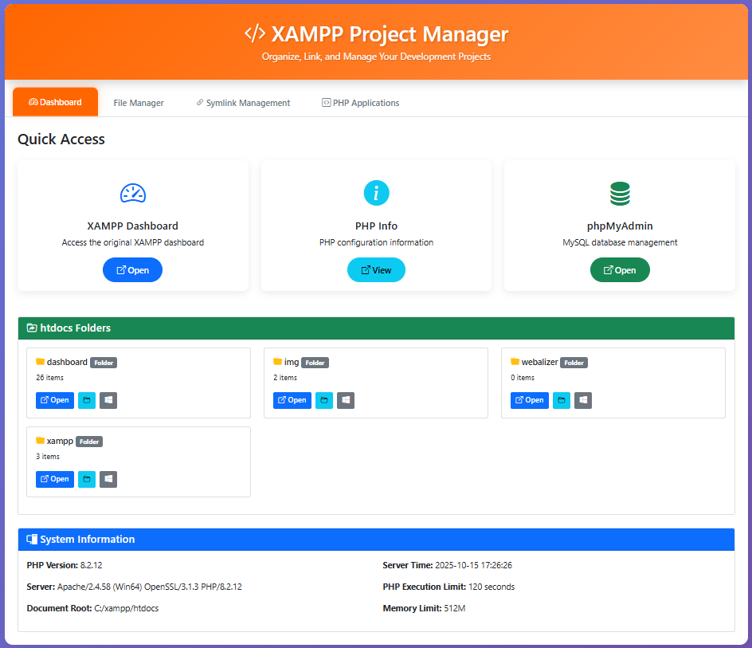
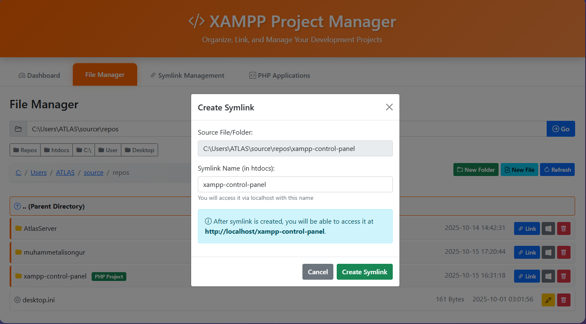
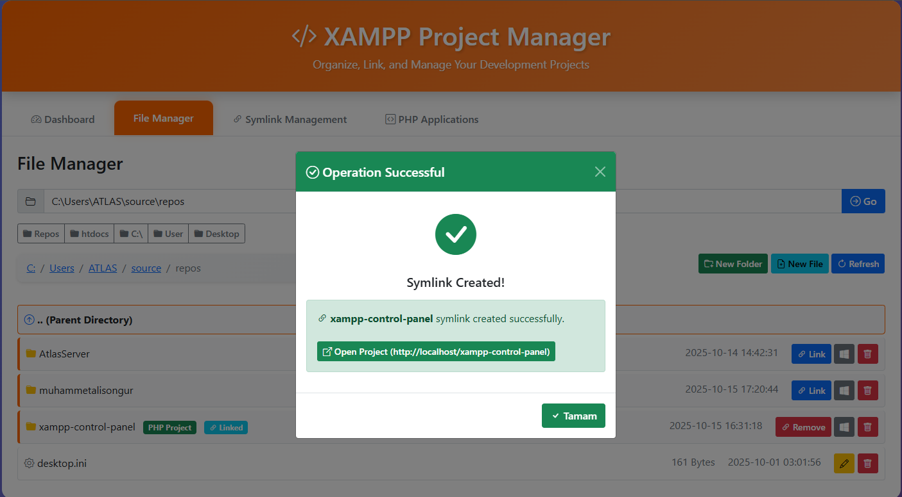
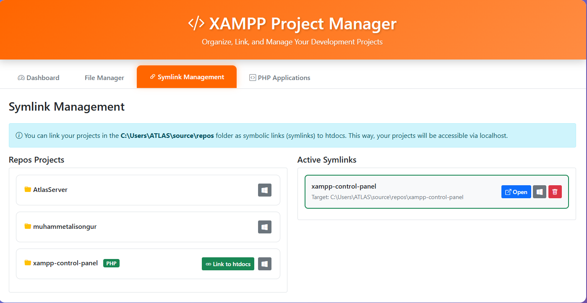
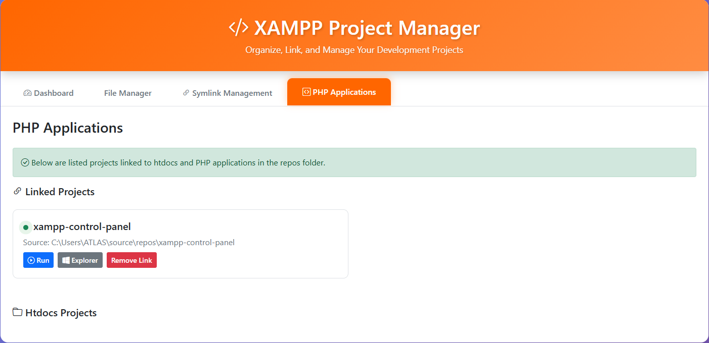

# XAMPP Project Manager

A simple tool to manage your projects in XAMPP easily.

[🇹🇷 Türkçe README için tıklayın](README_TR.md)

## What Does It Do?

- Keep your projects in `C:\Users\username\source\repos` and access them from XAMPP
- Edit files, create new ones
- Open projects in browser with one click
- Switch between dark/light themes

## Screenshots

*Dashboard with quick access to tools*

*File Manager with symlink creation modal*

*Success notification after creating symlink*

*Manage your project symlinks*

*View all linked PHP projects*

## Requirements

- XAMPP installed
- Windows OS

## Installation

1. Put `index.php` file in `C:\xampp\htdocs\`
2. Go to `http://localhost/` in your browser
3. That's it!

## How to Use?

### Link Projects (Symlink)
1. Click **Symlink Management** tab
2. Select a folder from your projects
3. Click **Link to htdocs** button
4. Give your project a name (e.g., "my-project")
5. Now you can access it at `http://localhost/my-project`

### Edit Files
- Browse files in **File Manager** tab
- Click any file to edit
- Click Save button to save changes

### New File/Folder
- Click **New File** or **New Folder** buttons
- Enter a name
- Click Create

## Features

✅ Keep projects outside htdocs
✅ Built-in file editor
✅ Dark mode support
✅ Colored icons for file types
✅ Quick access to phpMyAdmin

## Having Issues?

### Symlink not working
- Run the generated .bat file as administrator

### File won't open
- Files larger than 5MB won't open
- Check file permissions

## License

MIT - Use it however you want.

---

Feel free to open an issue for questions.