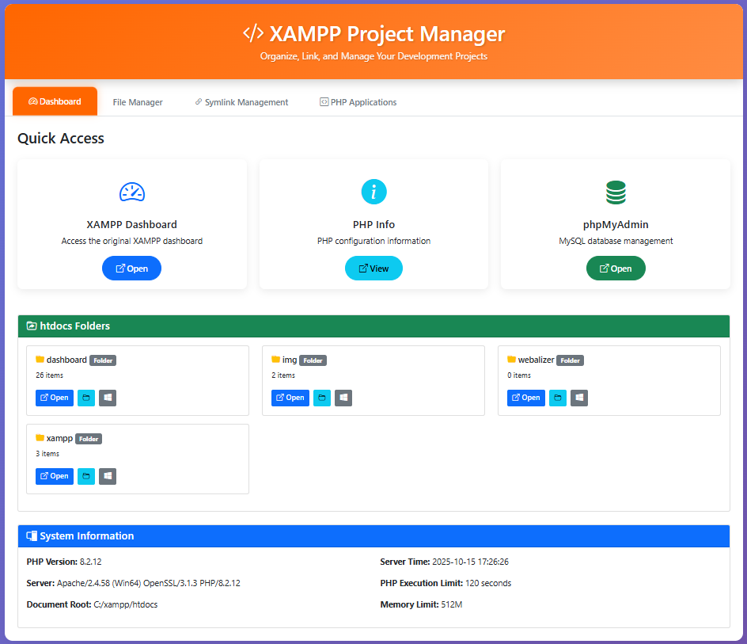
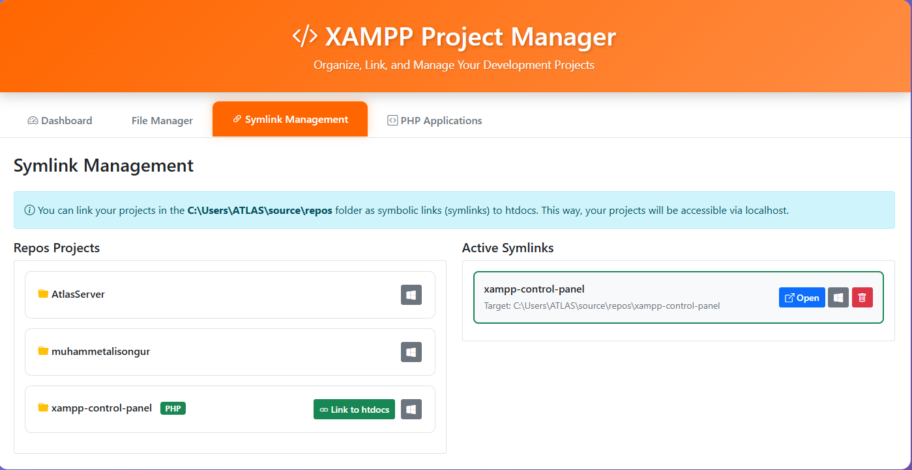
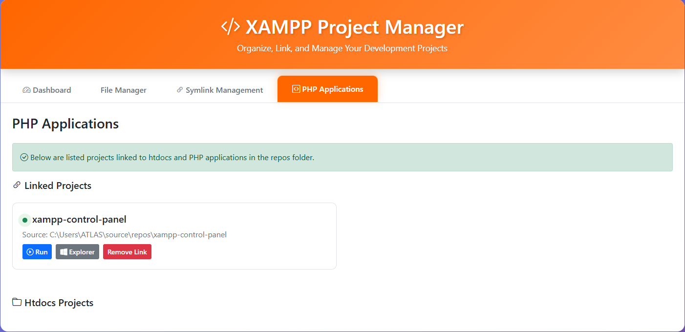

# XAMPP Project Manager

XAMPP'ta projelerinizi kolayca yönetmenizi sağlayan basit bir araç.

[🇬🇧 For English README click here](README.md)

## Ne İşe Yarar?

- Projelerinizi `C:\Users\kullanici\source\repos` klasöründe tutup, XAMPP'tan erişebilirsiniz
- Dosyalarınızı düzenleyebilir, yeni dosyalar oluşturabilirsiniz
- Projelerinizi tek tıkla tarayıcıda açabilirsiniz
- Karanlık/aydınlık tema seçeneği vardır

## Ekran Görüntüleri

*Hızlı erişimli kontrol paneli*

*Symlink oluşturma pencereli dosya yöneticisi*

*Symlink oluşturduktan sonra başarı bildirimi*

*Proje symlinklerinizi yönetin*

*Bağlı tüm PHP projelerini görüntüleyin*

## Gerekenler

- XAMPP kurulu olmalı
- Windows işletim sistemi

## Kurulum

1. `index.php` dosyasını `C:\xampp\htdocs\` klasörüne atın
2. Tarayıcıdan `http://localhost/` adresine girin
3. Hepsi bu!

## Nasıl Kullanılır?

### Proje Bağlama (Symlink)
1. **Symlink Management** sekmesine tıklayın
2. Projelerinizin olduğu klasörden birini seçin
3. **Link to htdocs** butonuna basın
4. Projeye bir isim verin (örn: "test-projesi")
5. Artık `http://localhost/test-projesi` adresinden projenize ulaşabilirsiniz

### Dosya Düzenleme
- **File Manager** sekmesinden dosyalarınıza göz atın
- Herhangi bir dosyaya tıklayıp düzenleyin
- Kaydet butonuna basın, değişiklikler kaydedilir

### Yeni Dosya/Klasör
- **New File** veya **New Folder** butonlarına basın
- İsim verin
- Oluştur'a tıklayın

## Özellikler

✅ Projelerinizi htdocs dışında tutabilirsiniz
✅ Dosya düzenleyici var
✅ Karanlık mod var
✅ Dosya türlerine göre renkli iconlar
✅ phpMyAdmin'e hızlı erişim

## Sorun mu Var?

### Symlink çalışmıyor
- Oluşan .bat dosyasını yönetici olarak çalıştırın

### Dosya açılmıyor
- 5MB'tan büyük dosyalar açılmaz
- Dosya izinlerini kontrol edin

## Lisans

MIT - İstediğiniz gibi kullanabilirsiniz.

---

Sorularınız için issue açabilirsiniz.